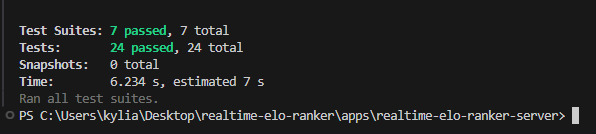
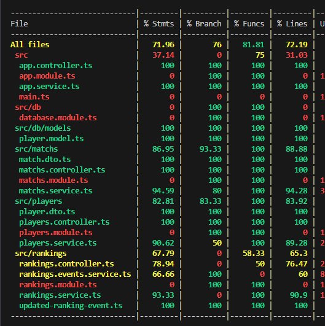

# TP Développement avancé

## Description

Serveur backend de l'application REALTIME-ELO-RANKER.

Serveur développé par Kylian Riberou. C'est une API qui expose des routes pour la gestion de joueurs, de leur rang, et pour l'enregistrement de matchs entre joueurs.

Une description de ces routes est accessible [dans le dossier docs/swagger](../../docs/swagger/swagger.yaml). 

[Nest](https://github.com/nestjs/nest) framework TypeScript starter repository.

## Vidéo de démonstration

Dans le cas où vous n'arriveriez pas à lancer le projet ( y compris le client frontend ), la vidéo suivante présente une courte démonstration de l'interface client utilisant les des routes exposées par le serveur.

<video src="./assets/video_presentation_client_serveur.mp4" 
width="" height="" controls>

## Lancer le projet

dans le dossier de projet `apps/realtime-elo-ranker-server` ( celui où se trouve ce fichier ), lancer la commande suivante : 

````bash
pnpm run start:dev
````

Ensuite lancer le client en suivant les instructions dans son dossier respectif.

## Fonctionnalités implémentées

Routes spécifiées :
- créer un joueur
- récupérer tous les joueurs
- jouer un match entre joueurs
- s'abonner au flux de mise à jour de joueurs

Le serveur backend comprends donc les fonctionnalités suivantes : 
- implémentation des routes présentées précédemment
- calcul de l'elo des joueurs pour déterminer le résultat d'un match ou l'élo de base d'un nouveau joueur créé
- Base de données `SQLite` pour le stockage des rangs de joueur, avec l'ORM `Sequelize`
- Utilisation d'un **Event-Emitter** pour gérer et transmettre des informations à chaque modification d'informations de joueurs
- **SSE** ( Server-Side Events ) : envoi automatique aux clients abonnés des mises à jour de rang effectuées par le serveur
- **Système de mise en cache** sur les rangs des joueurs et l'historique des matchs, pour éviter trop de requêtes dans la base de données
- Tests d'intégration et de bout en bout pour s'assurer que l'application est bien fonctionnelle, avec une bonne couverture de code

## Détail des fonctionnalités implémentées

### Base de données

Base de données SQLite contenant les informations de joueurs.

Création de la table player avec l'ORM **Sequelize**.

```typescript
import { Table, Column, Model, DataType } from 'sequelize-typescript';

@Table
export class Player extends Model {
    @Column({
        type: DataType.STRING,
        allowNull: false,
        primaryKey: true,
    })
    id: string;

    @Column({
        type: DataType.INTEGER,
        allowNull: false,
        defaultValue: 1000,
    })
    rank: number;
}
```

### Emission d'évènements

Grâce à l'EventEmitter de Nest, nous pouvons émettre des événements à certains endroits de l'application, auxquels elle pourra réagir en conséquence. 

L'objectif ici est d'envoyer aux clients les données mise à jour à chaque évènement émis lors de la modification du rang d'un joueur.

[app.module.ts](./src/app.module.ts)
```typescript
@Module({
  // initialisation du module EventEmitter
  imports: [EventEmitterModule.forRoot(), RankingModule, PlayersModule, MatchModule, DatabaseModule],
  controllers: [AppController],
  providers: [AppService],
})
export class AppModule {}
```

Emission d'un évènement après la création d'un joueur.

[player.service.ts](./src/players/players.service.ts)
```typescript
  @Injectable()
  export class PlayersService {
    constructor(@InjectModel(Player) private playerModel: typeof Player,
      private eventEmitter: EventEmitter2
  ) {}

    async create(id: string): Promise<PlayerDto | null> {
      const rank = await this.calculateDefaultRanking();
      try {
        const player = await this.playerModel.create({ id, rank });
        console.log("Emit updated-ranking after player creation");
        // emission évènement
        this.eventEmitter.emit('updated-ranking', new UpdatedRankingEvent(player.id, player.rank));
        return PlayerDto.fromEntity(player);
      } catch (err) {
        console.error(err);
        return null;
      }
    }
  }
```

Et émission d'un évènement pour publier les résultats d'un match

[match.service.ts](./src/matchs/matchs.service.ts)
```typescript
 async registerMatchResult(winnerId: string, loserId: string, draw: boolean) {

    // code pour le calcul du résultat du match
    // ...
    
    // émission évènements pour modification du rang des deux joueurs
    console.log("Emit updated-ranking after match result");
    this.eventEmitter.emit('updated-ranking', 
      new UpdatedRankingEvent(winnerDto.id, winnerDto.rank));
    this.eventEmitter.emit('updated-ranking',
      new UpdatedRankingEvent(loserDto.id, loserDto.rank));
      
    return { winnerDto, loserDto };
  }
```

Dès qu'un évènement est émis, il est récupéré dans la classe `RankingEventService` avec l'annotation `@OnEvent('updated-ranking')`

[ranking.events.service.ts](./src/rankings/rankings.events.service.ts)

```typescript
@Injectable()
export class RankingEventsService {
  private rankingUpdates = new Subject<UpdatedRankingEvent>();

  @OnEvent('updated-ranking')
  handleUpdatedRanking(payload: UpdatedRankingEvent) {
    console.log('Mise à jour classement : ', payload);
    // passe l'évènement généré au controller Ranking
    this.rankingUpdates.next(payload);
  }
}
```

Le controller ranking récupère cet évènement et l'envoie à tous les clients abonnés à la route, avec un **SSE**.

[rankings.controller.ts](./src//rankings/rankings.controller.ts)

```typescript
@Get('events')
@Sse()
subscribeToRankingUpdates(): Observable<MessageEvent> {
    console.log("a client Subscribed to ranking updates");
  // envoi aux clients des données mises à jour
    return this.rankingEventsService.getRankingUpdates().pipe(
    map((data) => ({
        data: JSON.stringify({
            type: "RankingUpdate",
            player: {
                id: data.id,
                rank: data.rank
            }
        })
    }))
    );
}
```

### Mise en cache


### Tests

Lancer les tests

```bash
$ pnpm run test

# e2e tests
$ pnpm run test:e2e

# test coverage
$ pnpm run test:cov
```

J'ai implémenté des tests unitaires et des tests d'intégration pour les différents modules de l'application : rankings, players et matchs.



Tous ces tests assurent une **couverture de code de l'application** de presque 100%. Seuls les modules ne sont pas testés ici car ils ne contiennent aucun code important et logique métier, mais que des imports de fichiers.


